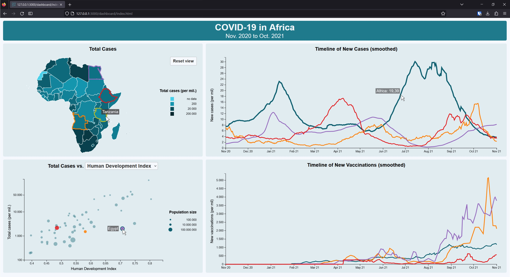

# COVID-19 Dashboard for Africa

## About
Repository for the last Assignment (A5) of the lecture "Visual and Exploratory Data Analysis" summer term 2023 at University of Vienna.

The dashboard shows COVID-19 data from Nov. 2020 to Oct. 2022.

[LIVE DEMO]([url](https://f-krause.github.io/veda_23_covid_dashboard/))

  

## Data
- COVID Data: https://github.com/owid/covid-19-data/tree/master/public/data
- In particular, used the full csv file from [here](https://covid.ourworldindata.org/data/owid-covid-data.csv).
- Geodata from (but adapted to work with covid data): https://raw.githubusercontent.com/codeforgermany/click_that_hood/master/public/data/africa.geojson

License does not apply to the data provided!

 

## The Dashboard

